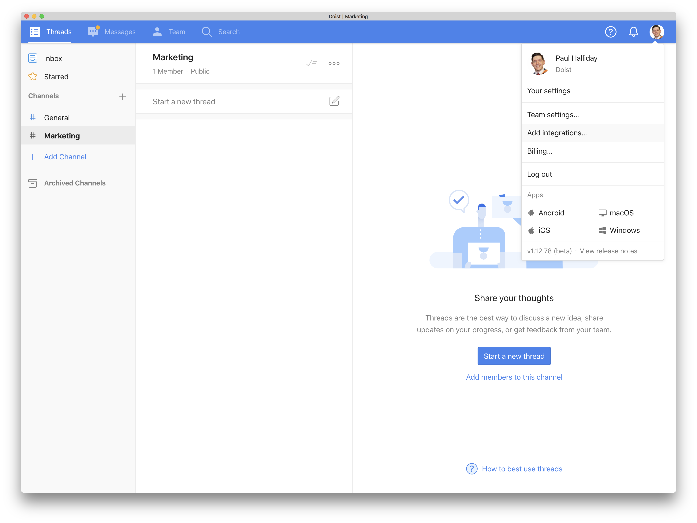
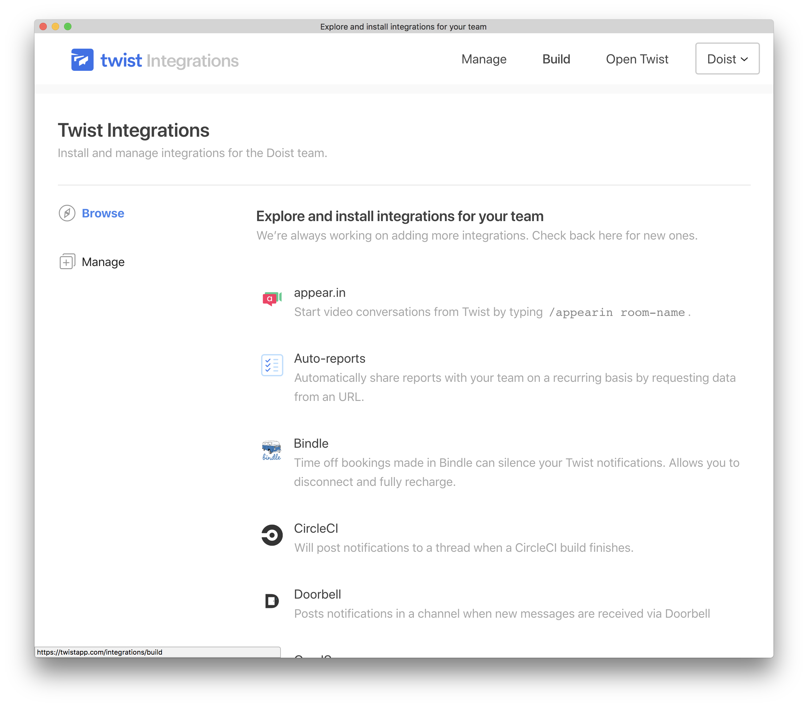
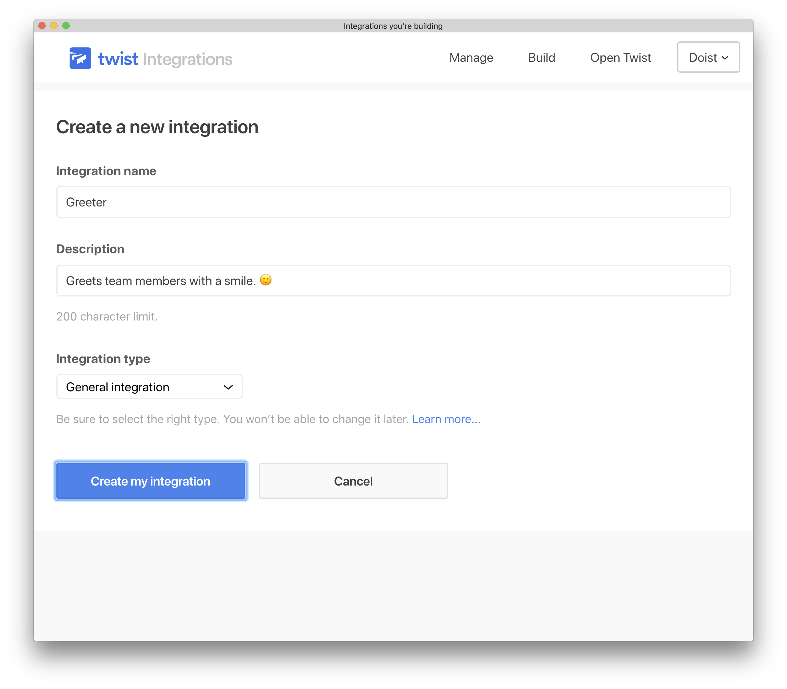
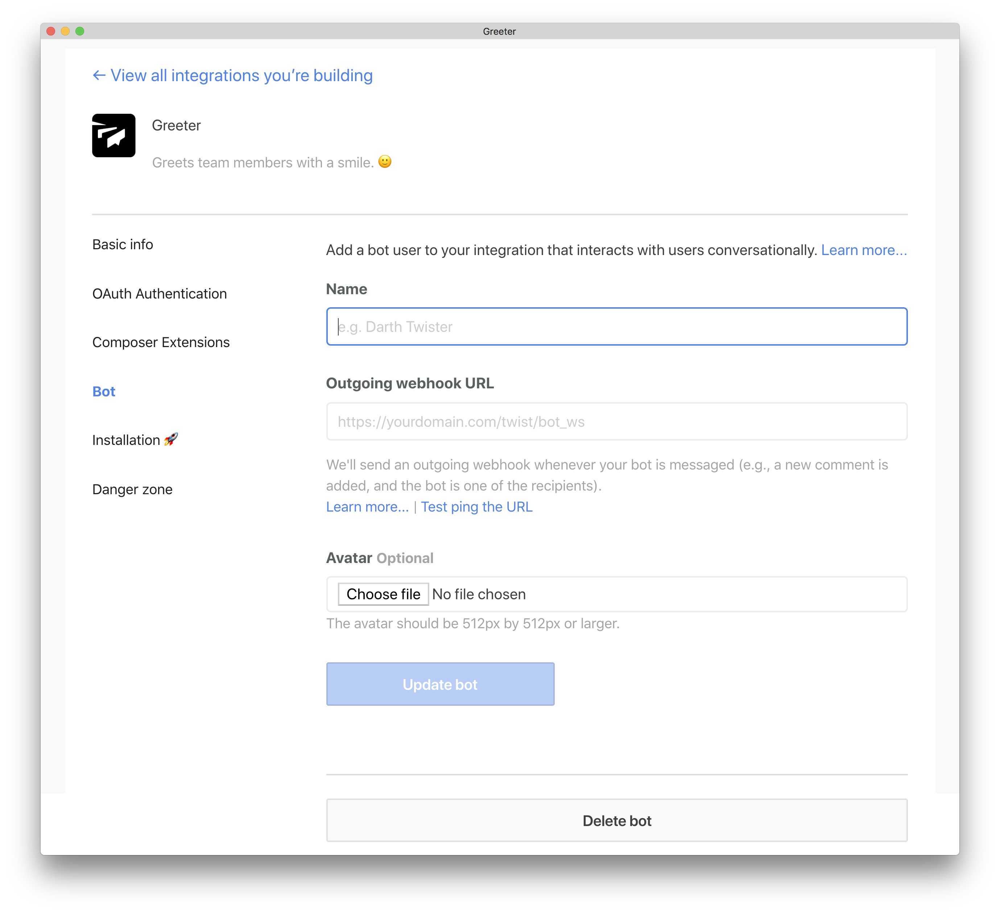
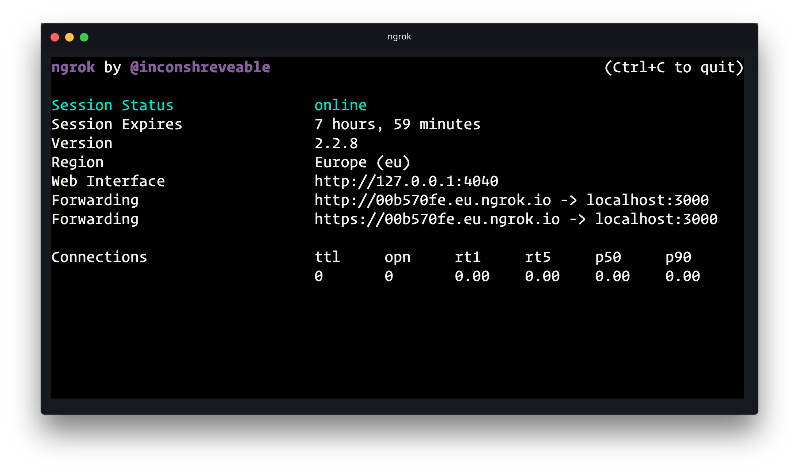
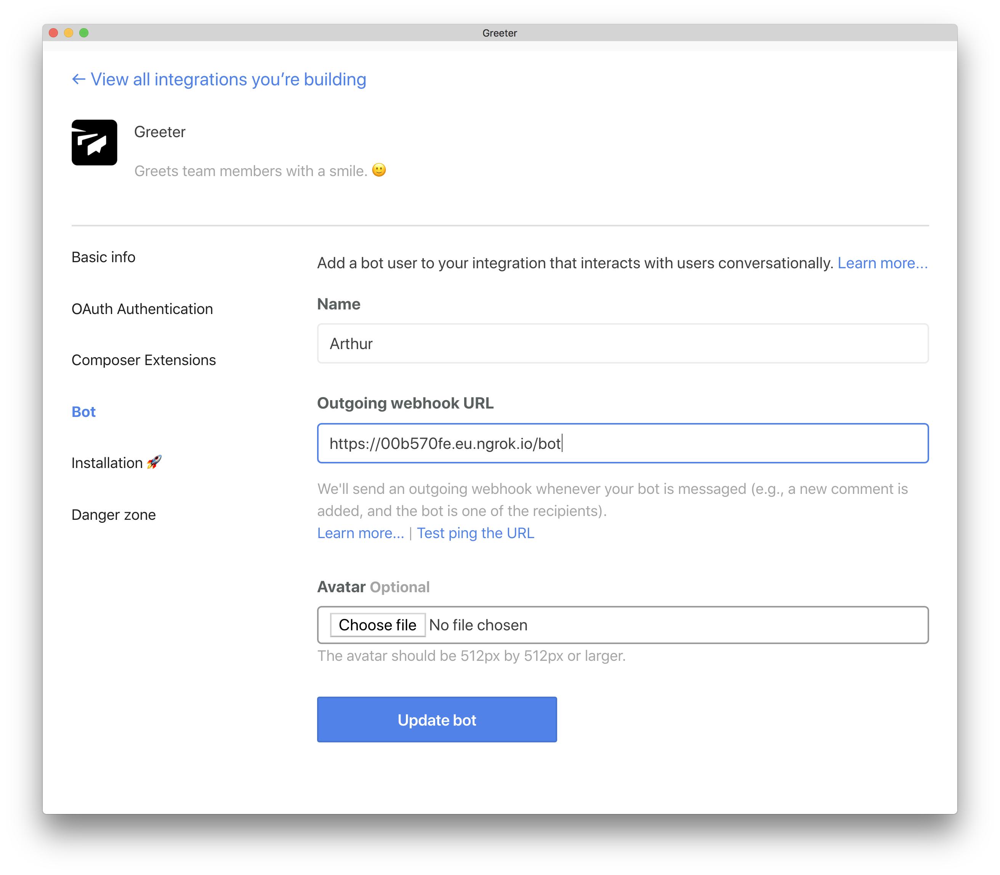
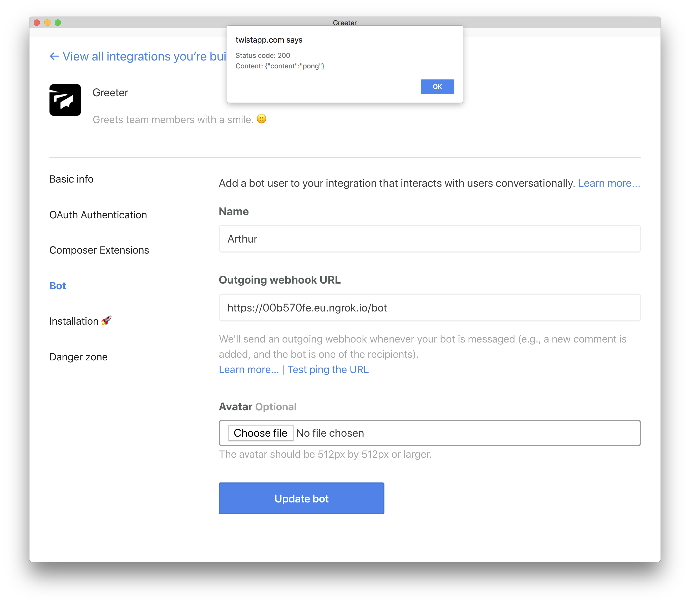

# Bot tutorial

In this tutorial, we'll create a simple Twist bot using Node.js. Our bot will be able to respond to new threads, comments, and private messages.

### Prerequisites 

Although we based this tutorial on Node and JavaScript, the concepts work in other languages and frameworks as well. 

We'll need the following tools:

* [Node.js](https://nodejs.org/en/).
* A Twist account/workspace.
* [ngrok](https://ngrok.com) | `npm install ngrok -g`.

## New project

Start by creating a new [Node.js](https://nodejs.org/en/) and [Express](https://expressjs.com/) application.

To create a new Node project, run the following in your terminal:

```shell
# Create a new directory
$ mkdir twist-bot

# Change directory
$ cd twist-bot

# Initiate a new Node project
$ npm init -y

# Create a bot.js file
$ touch bot.js
```

### Install the required dependencies
Next up, we'll need to install `express` and `body-parser` to our project. 

```shell
# Install project dependencies
$ npm install express body-parser
```

## Server Setup

```javascript
const express = require('express');
const bodyParser = require('body-parser');

const app = express();

// Parse POST requests with JSON or URLEncoded
app.use(bodyParser.json());
app.use(
  bodyParser.urlencoded({
    extended: true,
  }),
);

app.listen(process.env.PORT || 3000, () =>
  console.log(`Server listening on port ${process.env.PORT || 3000}`),
);
```

We can set up a listening server with Express. Express will allow us to define our routes and react to incoming events. 


## Nodemon

```shell
# Install nodemon globally
$ npm install nodemon -g

# Run our server with nodemon.
$ nodemon bot.js
```

We can then run our project using `nodemon`. Any changes to our code will restart our Node server, allowing for smoother development experience. 

Run the following in your terminal:

## Webhooks

```javascript
app.post('/bot', (req, res) => {
  const body = req.body;
  console.log(body);
});
```

We can then define a new route at which our Webhook will point. Any time we interact with the bot, the request will end up at this endpoint.

Currently, this route is defined but not used. We'll need to expose our application and create an integration/webhook based on user events. We can log the `body` to see a typical interaction example once we've created the integration.

We won't be able to see the results of this until we create an integration on Twist and make a test event. Let's do that next!

## New Twist integration

Navigate to [your Twist team](https://twist.com) and select "Add Integrations" from the top-right dropdown menu. 



From here, let's go to the integrations dashboard. The dashboard shows us all the available integrations for our Twist team, as well as the ability to manage and create new ones.



To create a new Twist integration, select "Build" from the navigation menu, and select "Add new integration". We can then select "General Integration" and fill out appropriate project information.



Select "Create my integration" to finish the process.

We're then navigated to the integration details screen, giving us the ability to add extra functionality. As we're only to build a bot right now, select "Bot".



We now need to provide an Outgoing Webhook URL which will listen for incoming Twist events. For that, we need to leverage `ngrok`.

Inside of a new terminal window (but the same directory), run the following:

```shell
$ ngrok http 3000
```




```shell
# Endpoint URL
https://00b570fe.eu.ngrok.io/bot
```
Ngrok gives us the ability to test our bot without having to upload the code to a web server. Within the "Bot" part of your integration settings, add the Forwarding URL to the Outgoing Webhook URL field, ensuring to add the `/bot/` endpoint that we created earlier. 



To test everything works as intended, select the "Test ping the URL" button. The button sends a request to our `/bot/` route and log out the request body inside of our terminal.

A typical response will look like this:

`{ event_type: 'ping', verify_token: '221_3c2c24332bbcd3cd22dec12' }`

```javascript
app.post('/bot', (req, res) => {
  const body = req.body;
  console.log(body);

  if (body.event_type === 'ping') {
    res.json({ content: 'pong' });
  }
});
```

As this is a debugging payload, we'll respond with `{ content: 'pong' }`. 

If we click the "Test ping URL" button once again, you'll notice that we can see the "pong" payload that we sent back as an alert within the browser.



## Event types

So far, we've got ourselves a bot that _exists_, but doesn't say (or do) anything. We can choose to add functionality to our bot by first determining the type of communication. 

The `event_type` response will be different depending on the context:

| Event type | Description |
| ---------- | ----------- |
| ping | Used for debugging purposes. |
| thread | Appears whenever the bot is notified in a new thread. |
| comment | Appears whenever the bot is mentioned in a comment. |
| message | Appears whenever the bot is messaged. | 

We can, therefore, use this to send personalized responses or actions depending on the type of user interaction. 

## Responding to users

```javascript
const handleMessage = body => {
  switch (body.event_type) {
    case `ping`:
      return { content: `pong` };
    case `thread`:
      return `Thanks for notifying me of this thread!`;
    case `comment`:
      return `Interesting you should mention that. I was thinking the same thing!`;
    case `message`:
      return `Hello, ${body.user_name}! I hope you're having a great day.`;
    default:
      return { content: `` };
  }
};

app.post('/bot', (req, res) => {
  const body = req.body;

  const response = handleMessage(body);

  res.send(response);
});
```

Similar to responding to the `ping` requests, we can take advantage of the `thread`, `comment`, and `message` event types to apply context to our bot. 

Therefore, by responding to these events, our resulting actions become the following:

| Event type | Action |
| ---------- | ----------- |
| Notified in a new thread | "Thanks for notifying me of this thread!" |
| Mentioned in a comment | "Interesting you should mention that. I was thinking the same thing!". |
| Direct message | "Hello, Paul! I hope you're having a great day". | 

