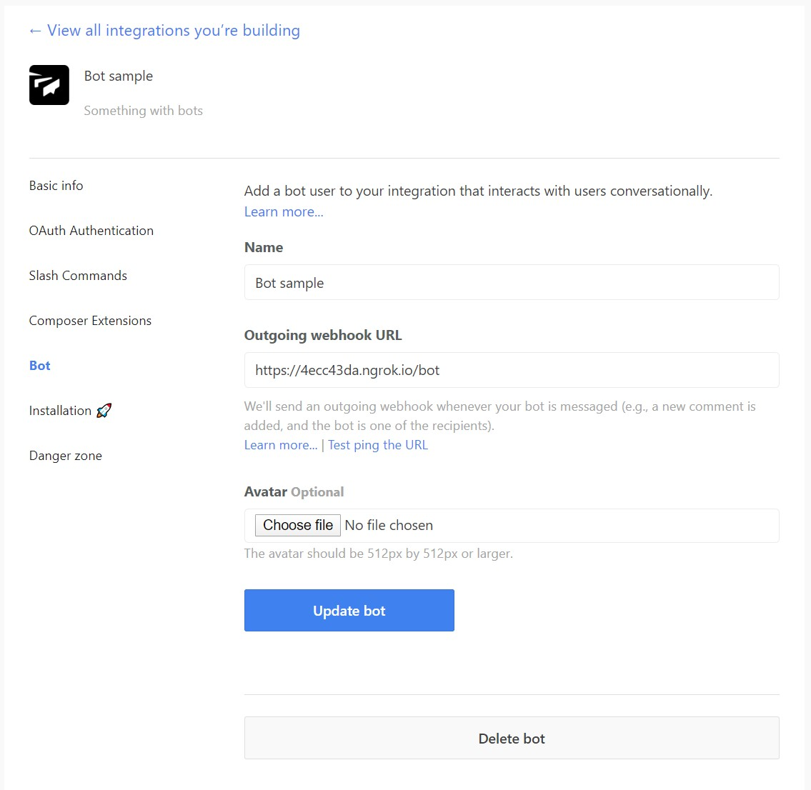
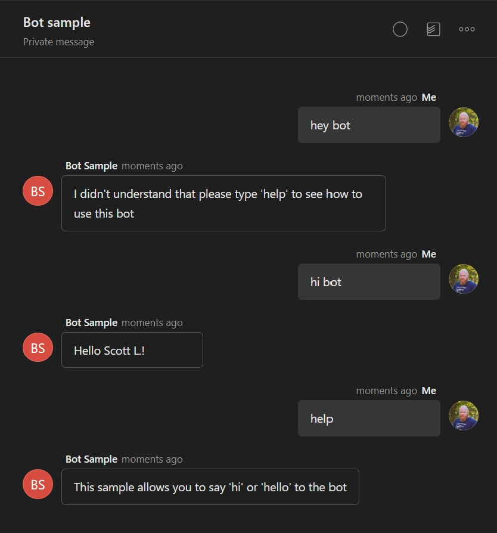

# Long Running Task Go Sample

This is a code sample demonstrating how to perform a long running task when dealing with [bots](https://developer.twist.com/v3/#bot) in Twist. The purpose of this is to show that bots can respond in a timely manor and avoid hitting the timeout restriction of 10 seconds, regardless of what your bot actually needs to do in the background.

To run this sample we will need to setup and configure a few things:
- [ngrok](https://ngrok.com/) to forward the Twist calls to your local server
- An integration on Twist
- Run the server

## Setup ngrok

In order for your integration to work, Twist needs to know where to send the command/bot data, and for this, you will need a running web server. Whilst you're developing your integration, you may not have a dedicated web server setup for this, and you just want to point to your local machine, this is where [ngrok](https://ngrok.com/) comes in as it can forward the call to your local server. Head to the [ngrok download page](https://ngrok.com/download) to get that installed.

Once installed, you can simply call
```
ngrok http 5000
```

This will start a session that points to port 5000.


Make a note of the second forwarding URL (in the example, https://4ecc43da.ngrok.io) as we will need this in the next step.

## Setup your integration

To create your integration, go to https://twist.com/integrations/build and click the `Add a new integration` button.

Once you've given it a name and a description, press `Create my integration`; for this sample we will mainly look at Bots. If you go to the Bot section, enter the details of your bot like below



It's here you need that ngrok URL from earlier, enter that into the Request URL with `/bot` at the end as that's the endpoint we are using in the code. Your integration may be different.

Once all that is done and saved, click on `Installation`, make sure you are in the right Twist workspace, and click `Install integration`.

## Run the server

Just start the server running with

```
go run .
```

With that complete, you can now go to a conversation with the bot and type something like "hello bot" and it will reply to you.
